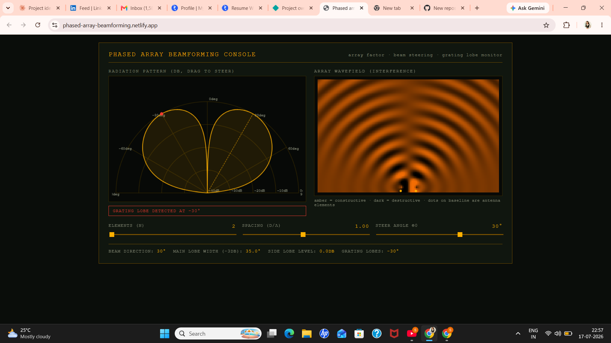

# Phased array beamforming console

An interactive, radar-console-style visualizer for phased array beamforming — the core technique behind 5G massive MIMO base stations, radar, and sonar systems.

**Live demo:** https://phased-array-beamforming.netlify.app/

## What it does

Beamforming uses multiple antennas, each fed with a precisely calculated phase shift, so their signals combine constructively in one direction and cancel out in others — effectively "pointing" a beam without moving anything physically.

This console lets you:

- Adjust the **number of antenna elements** (2–16)
- Adjust **element spacing** in wavelengths (d/λ)
- **Steer the beam** by dragging directly on the polar radiation pattern, or via the slider
- Watch a **live animated wavefield** showing actual wave propagation and interference from each element
- See **grating lobe warnings** — a real antenna design failure mode where spacing too wide creates unwanted duplicate beams

## The math

For an N-element linear array with spacing `d` (in wavelengths) steered to angle `θ0`, the array factor is:
